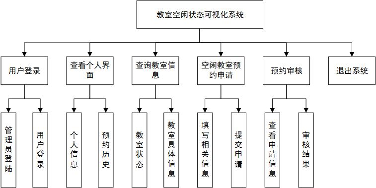
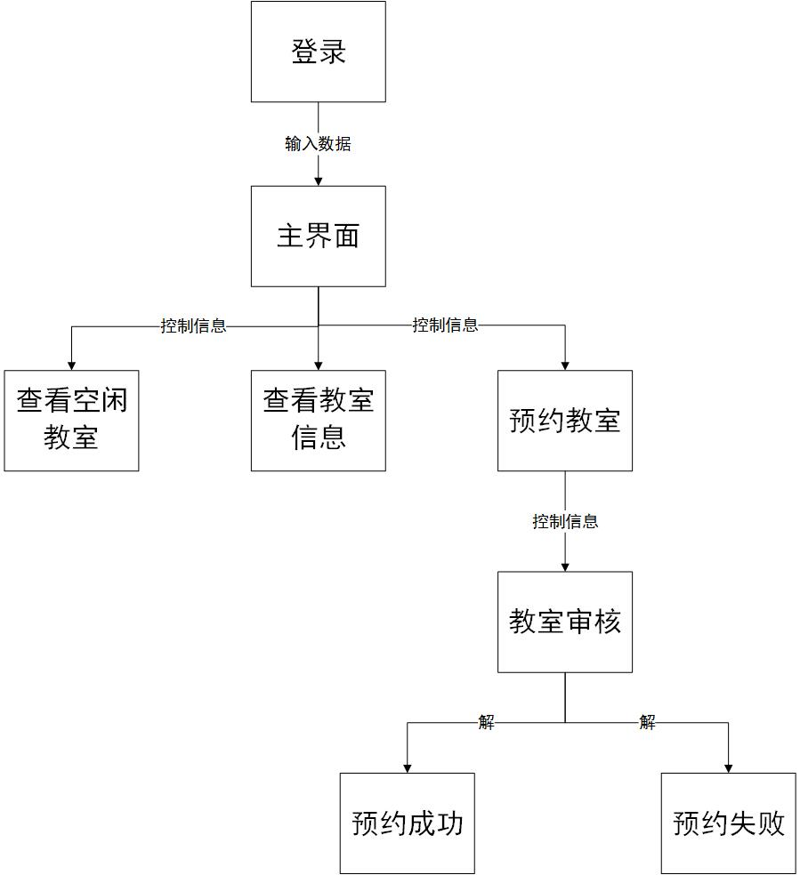
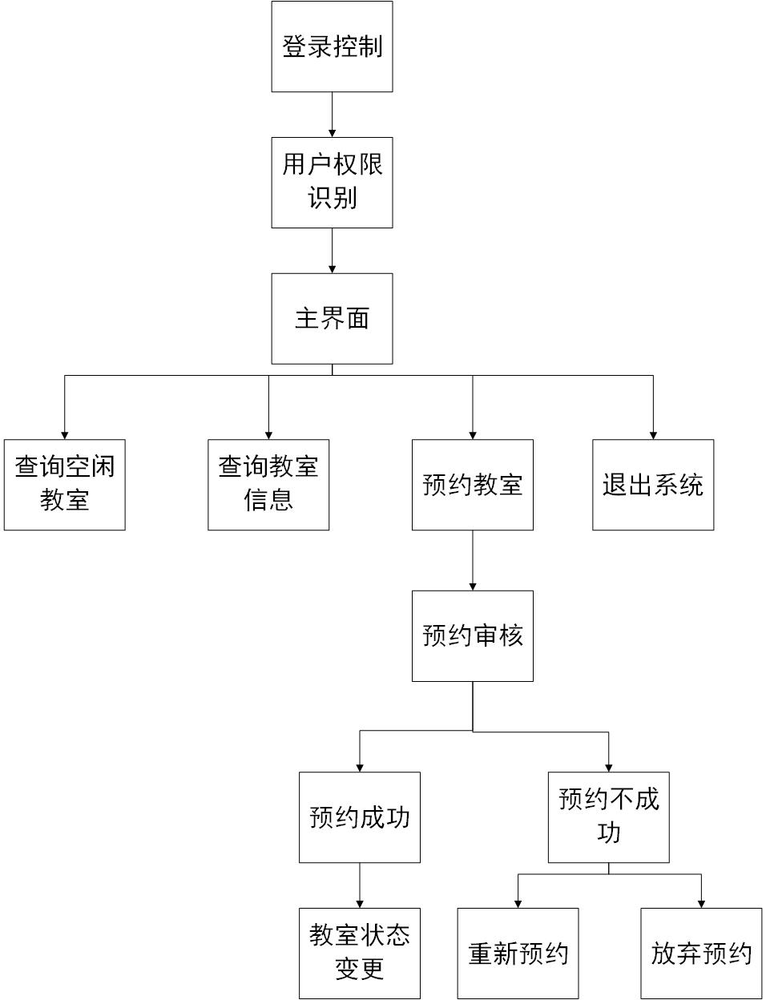

# Visualization-for-classroom-status
# 总体设计
## 1 系统总体设计
本系统为用户提供一个能够登录，查看教室空闲状态，预约空闲教室，为管理员提供一个快速审核并通过预约申请台。  
本系统主要分为以下几个模块：登录模块，教室信息查询模块，教室预约模块，申请审核模块。
## 2 各模块功能描述
### 2.1 登录模块
#### 2.1.1 用户登录部分
用户打开该软件后，输入用户名和密码，系统将识别该用户的权限为管理员或用户。
#### 2.1.2 主界面部分
登陆后系统将跳转到相应的个人信息界面，其中显示着该用户的借阅历史，以及一些教室的空闲状态。
### 2.2 教室信息查询模块
用户能通过菜单栏——查询——空闲教室，查看各个教室的状态并了解相应教室的信息。此外，还能通过容纳人数，空闲时间段，教室类型等条件来多重查询符合要求的教室。
### 2.3 预约教室模块
用户通过查找到的教室能够快速的发起预约，在填写完相关信息之后就可以提交申请，等待审核结果。
### 2.4 申请审核模块
管理员登陆后可以接收到预约申请，通过查看提交的相关信息来确定是否给予通过。若通过，系统自动修改教室状态并将信息反馈给申请者；若不通过，则只给申请者反馈相应信息。
## 3 系统层次结构
### 3.1 系统层次图
  
### 3.1 系统结构图 
  
## 4 面向数据流的事务分析
  
## 5 开发平台
基于HTML5开发。  
> HTML5是HTML最新的修订版本，由万维网联盟（W3C）于2014年10月完成标准制定。目标是取代1999年所制定的HTML 4.01和XHTML 1.0标准，以期能在互联网应用迅速发展的时候，使网上标准达到匹配当代的网上需求。广义论及HTML5时，实际指的是包括HTML、CSS和JavaScript在内的一套技术组合。它希望能够减少网页浏览器对于需要插件的丰富性网上应用服务（Plug-in-Based Rich Internet Application，RIA），例如：Adobe Flash、Microsoft Silverlight与Oracle JavaFX的需求，并且提供更多能有效加强网上应用的标准集。
