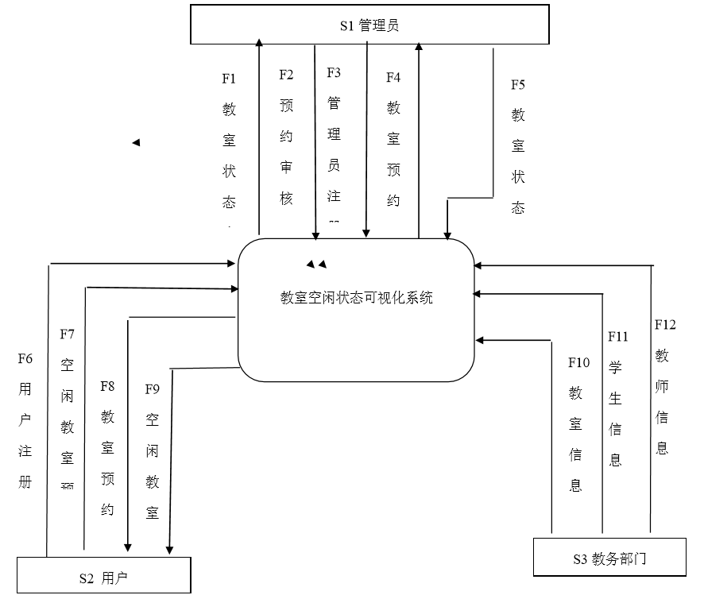
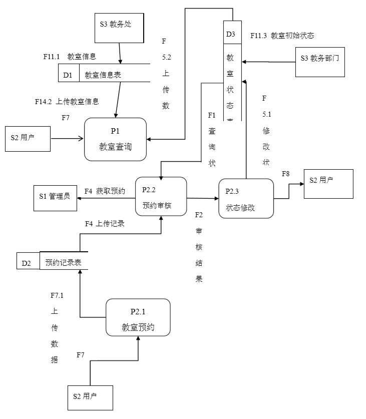
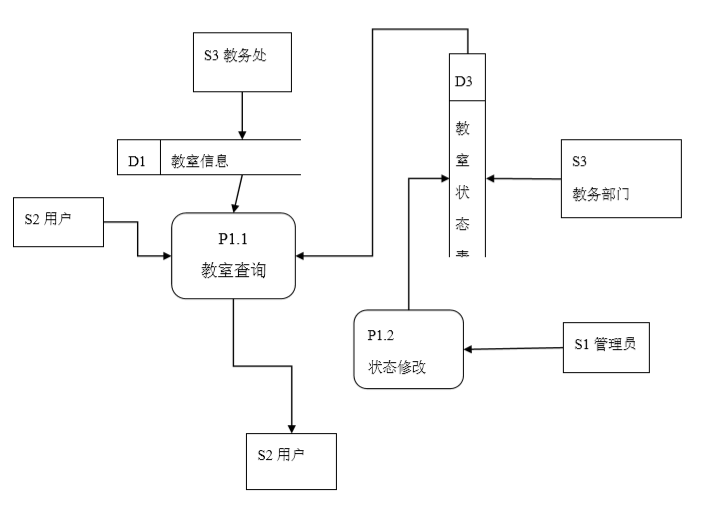
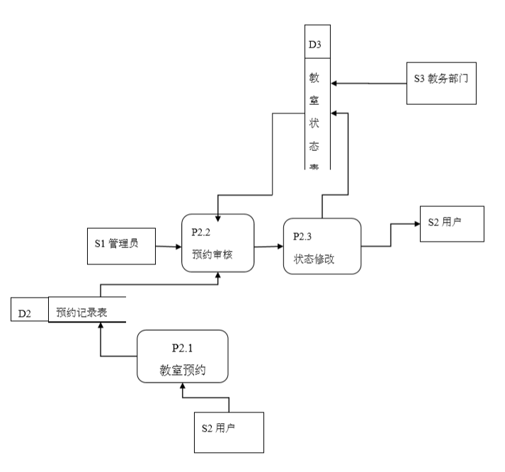

# Visualization-for-classroom-status
# 需求分析
## 1 引言
### 1.1 目的
本软件需求说明书全面、概括性地描述了教室空闲状态可视化系统所要完成的工作，使软件开发人员和用户对本系统中的业务流程及功能达成共识。通过本需求说明书可以全面了解教室空闲状态可视化系统所要完成的任务和所能达到的功能。
### 1.2 背景
随着计算机技术、网络技术和信息技术的发展，现在教室管理系统更趋于系统化、科学化和网络化。网络办公自动化系统是计算机技术和网络迅速发展的一个办公应用解决方案，它的主要目的是实现信息交流和信息共性，提供协同工作的手段，提高办公的效率，让人们从繁琐的有纸办公中解脱出来。现在许多的学校单位的人事管理水平还停留在纸介质的基础上，这样的机制已经不能适应时代的发展，因为它浪费了许多的人力和物力，在信息时代这种传统的管理方法必然被计算机为基础的信息管理所取代。  
本系统是对教室的使用情况以及空闲状态进行管理，为用户提供了一套操作简单、使用可靠、界面友好、易于管理和使用的处理工具。本系统对教室进行统一处理，避免数据存取、数据处理的重复，提高工作效率，减少了系统数据处理的复杂性。本系统不仅使管理人员从繁重的工作中解脱出来，而且提高了教室管理的效率，提高了教室管理的科学性，方便了用户查询、管理人员进行管理。
### 1.3 参考资料
暂无
## 2 任务概述
### 2.1 目标
项目目标应当符合智能、简单明了的原则，把项目要完成的工作用清晰的语言描述出来。教室空闲状态可视化系统的项目目标如下：  
教室空闲状态可视化系统的主要目的是实现教室的信息化、可视化管理，主要业务就是实现教室查询信息与教室申请信息的管理。项目实施后，能够降低管理成本、合理控制人员调动、提高工作效率。
### 2.2 系统（或用户）的特点
#### 系统特点：  
它是一个为教学管理服务的可视的信息系统，它必须能够根据使用者的需要，及时提供所需要的可视化信息，以及完成所需操作。
#### 用户特点：  
#### 用户类说明：  
教务部门：教务部门的成员是本系统的部分信息的维护、管理人员，可以发布教室的使用、借出情况等。  
非管理人员（教师及学生）：是本系统的主要使用者，可以查看教室被使用的相关信息。  
管理员：管理员是本系统的最终信息维护人员，可以添加修改教师及学生的信息等。  
### 2.3用户场景 
#### 1.背景
##### （1）典型用户：
| 姓名 | 金肯 |
| ------| ------ |
| 性别 | 男 |
| 身份 | 学生会干部 |
| 个人情况 | 学生会活动较多，需要经常借教室 |
| 典型场景 | 每次活动借教室都要跑一趟 |
| 典型描述 | 减少时间的浪费 |

| 姓名 | 李华 |
| ------| ------ |
| 性别 | 男 |
| 身份 | 电子信息工程大一班长 |
| 个人情况 | 身为班长，每天都要找教室自习 |
| 典型场景 | 本来就时间不多，每天还要找教室，没空学习了 |
| 典型描述 | 减少重复的，不必要的工作 |

| 姓名 | 雷妮 |
| ------| ------ |
| 性别 | 女 |
| 身份 | 大一班导师 |
| 个人情况 | 自己有项目，大多数时间不在学校，没空借教室 |
| 典型场景 | 偶尔给学生开班会，还要提前来到学校借教室 |
| 典型描述 | 避免不必要的麻烦 |

| 姓名 | 陆岩 |
| ------| ------ |
| 性别 | 男 |
| 身份 | 教务处工作人员 |
| 个人情况 | 有很多工作要做，忙不过来 |
| 典型场景 | 借教室的同学来的时候会打乱原来的工作思路 |
| 典型描述 | 减少对其他人的打扰 |

##### （2）用户需求和待解决问题
学生：需要经常借教室但是自己时间不多造成困扰，希望能有一个系统能直接线上借教室或者长期借教室，希望系统能快速匹配自己想要的教室  
老师：不经常在学校，借教室比较麻烦，希望能够在线上预订教室。
##### （3）假设
功能全部实现  
上述用户使用了这个软件
#### 2.场景
学生会最近又要办活动了，需要接几个教室，董晓侃登录该系统网站：并快速搜索到了自己想要的教师并提交了申请。  
雷老师听同学们最近反馈了一些问题，想在自己上完课以后开一个简短的班会，于是在上课之前，她提交了自己的申请。  
工作人员陆某收到了网站提醒之后，先快速完成了手头的工作之后，审核了相关的申请，并给与通过。  
## 3 可行性分析
### 3.1 技术可行性
本次系统的开发与应用，大多使用的是我们正在学习或者将要学习的知识和理论，主要的开发工具是待定，这些工具我们都接触或者使用过，在技术上来说，本次开发是可行的。
### 3.2 社会可行性
本次系统的设计，是为了节省学校的人力物力，是能够被广大群众所接受的，从社会的角度，是被大众所认可的，所以是可行的
### 3.3 经济可行性
本次系统的开发与设计，主要开发的硬件环境为电脑，研发周期也不长，开发的人员主要为小组成员，从以上角度来说，并不会耗费过多的人力物力，也恰好是我们能够锻炼的一个环境，所以是可行的。
### 3.4 法律可行性
本次的系统的开发与设计，主要为一次学习的机会预体验，并未非法危害任何人的安全与利益，并未触犯任何法律法规，所以是可行的。
## 4 需求规定
### 4.1 软件功能说明
使用该系统有四个角色：教务部门，教师，学生，管理员。系统应当完成以下的信息处理： 
- 教室基本信息管理：包含教室信息的录入、修改等功能。 
- 教室使用信息管理：包含教室查询功能。 
- 教室申请信息管理：包含教室申请功能。 
根据系统业务流程和相关数据报表，采用结构化分析技术对系统作进一步分析。
## 5.数据流图 
  
然后，根据划分出几个主要的信息管理功能，并明确各功能之间的联系，绘制出系统的顶层数据流图：  
  
顶层数据流图仅从总体上反映了系统的信息联系，按照结构化分析方法，自定向下，逐层分解，对顶层图进行细化。细化进行到数据流图中的每一个数据处理成为一个很容易理解的单一功能，且这个单一功能可以通过简单的逻辑表达式在数据字典予以说明。本系统的数据流图绘制三层即可。得到的二层数据流如下：  
（1）P1（教室状态查询）的细化图  
  
（2）P2（预约教室）的细化图  
  
## 6．数据字典
### （1）数据流
| 数据流  |  |  |  |  |
| ------ | ------ | ------ | ------ | ------ |
| 系统名：用户信息管理系统 |
| 编号：F11、F12 |
| 条目名：学生、老师信息 |
| 别名： |
| 来源：用户（S2） |
| 数据流结构：用户编号+姓名+性别+联系电话 |
| 简要说明：用户的个人信息 |
| 修改记录 | 编写 |   | 日期 |   |	

| 数据流  |  |  |  |  |
| ------ | ------ | ------ | ------ | ------ |
| 系统名：教室状态查询子系统 |
| 编号：F11.1 |
| 条目名：教室信息 |
| 别名： |
| 来源：教务系统分配 |
| 数据流结构：教室编号+教室类型+教室容量+教室设备 |
| 简要说明：告知用户教室的大体情况 |
| 修改记录 | 编写 |   | 日期 |   |
### （2）数据项
| 数据元素  |  |  |
| ------ | ------ | ------ |
| 系统名 | 教室状态查询、预约教室系统 |
| 条目名 | 用户账号 |
| 别名 |   |
| 属于数据流 | F7~F9 |
| 存储处 | D2：预约数据表 |
| 数据元素类型 | 类型 | 字符型 |
|   | 长度 | 10 |
|   | 取值范围 | “0”~“9” |
|   | 含义 | 第1-4位：注册年份；第5-7位：专业；第8位：班级; 第9-10位：序号 |
| 简要说明 | 账号是每个用户的唯一标识码 |

| 数据元素  |  |  |
| ------ | ------ | ------ |
| 系统名 | 教室状态查询、预约教室系统 |
| 条目名 | 教室编号 |
| 别名 |  |
| 属于数据流 |  |
| 存储处 |  D1：教室信息表  D3:教室状态表 |
| 数据元素类型 | 类 | 字符型 |
|   | 长度 | 5 |
|   | 取值范围 | “0”~“9” |
|   | 含义 | 第1-2或第1位表示教学楼，第2或3位表示楼层，3-4或4-5位表示教室的编号 |
| 简要说明 | 教室的编号 |

### （3）数据存储
| 数据存储 |   |   |   |   |
| ------ | ------ | ------ | ------ | ------ |
| 系统名 | 教室预约系统 |
| 条目名 | 教室预约记录表 |
| 别名 |  |
| 编号 | D2 |
| 存储组织 | 二维表 |
| 记录数 |  |
| 数据量 |  |
| 主键编号 | 预约编号 |
| 辅键 | 预约人编号 |
| 记录组成 | 预约编号    预约人标号    教室代码    预约时间|
| 长度（字节） | 8        10（8）         5           9 |         
| 简要说明 | 存储预约记录 |
| 修改记录 |   | 编写 |   | 日期 |   |	

| 数据存储 |   |   |   |   |
| ------ | ------ | ------ | ------ | ------ |
| 系统名 | 教室状态查询子系统 |
| 条目名 | 教室信息表 |
| 别名 |  |
| 编号 | D1 |
| 存储组织 | 二维表 |
| 记录数 |  |
| 数据量 |  |
| 主键编号 | 教室编号 |
| 辅键 |  |
| 记录组成 | 教室编号    容纳人数   教室类型|
| 长度（字节） | 	5             4           5 |         
| 简要说明 | 教室的信息 |
| 修改记录 |   | 编写 |   | 日期 |   |	

| 数据存储 |   |   |   |   |
| ------ | ------ | ------ | ------ | ------ |
| 系统名 | 教室预约系统 |
| 条目名 | 教室状态表 |
| 别名 |  |
| 编号 | D3 |
| 存储组织 | 二维表 |
| 记录数 |  |
| 数据量 |  |
| 主键编号 | 教室代号 |
| 辅键 |  |
| 记录组成 | 教室代号    状态|
| 长度（字节） | 8               2 |         
| 简要说明 | 教室的使用情况 |
| 修改记录 |   | 编写 |   | 日期 |   |	

### （4）数据加工

### （5）外部实体
| 外部项 |   |   |   |   |
| ------ | ------ | ------ | ------ | ------ |
| 系统名 | 教师预约系统 |
| 条目名 | 用户 |
| 别名 | 	 |
| 编号 | S2 |
| 输入数据流 | 预约申请 |
| 输出数据流 | 申请结果 |
| 主要特征 |  |
| 简要说明 |  |
| 修改记录 |   | 编写 |   | 日期 |   |	

## 7.运行环境规定
### 7.1 设备及分布
客户端主机基本配置为：
### 7.2 支撑软件
- 操作系统
- Windows 以及Linux 等平台
- 数据库管理系统
- MySQL
### 7.3 程序运行方式
本系统属于独立运行程序
## 8.开发时间和资金估算
任务/阶段任务时间（周） 人员（人） 资金预算（元）
项目调研及规划
需求分析：
系统设计：
程序开发：
系统测试：
总计：
## 9.实现方案
- 需求分析阶段,产出：需求计划书。
- 概要设计阶段，产出：概要设计报告。
- 详细设计阶段，产出：详细设计报告。
- 编码阶段，产出：系统编码实现。
- 测试分析，产出：系统测试报告。
## 10 附录
  需求分析过程中会产生各种记录如调查表格、业务系统单据等。记录或报告的存档编号和名称填写在下表中。其中类别是记录的分类，一般有业务系统说明书、业务系统数据说明书、业务系统调查表、原始数据单据、业务系统参考资料。

